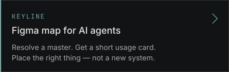
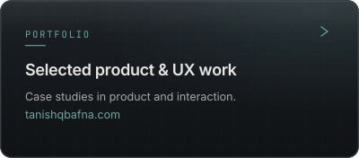

  

Product & UX designer based in Mumbai. I work on design systems, HCI, and tools that help AI build UI from real Figma libraries — without inventing a new system every time.

**Site:** [tanishqbafna.com](https://www.tanishqbafna.com)

## Building

  
  

## Focus

- Design systems & component libraries
- AI-assisted design workflows (Claude, Cursor, Codex + Figma)
- Clear product craft — humans set the rules, tools follow them

## Signal

<!-- Live cards via github-readme-stats.shion.dev (official vercel.app is often paused). Colors match assets/. -->

  
  

## Elsewhere

[tanishqbafna.com](https://www.tanishqbafna.com) · [LinkedIn](https://www.linkedin.com/in/tanishqbafna/) · [Behance](https://www.behance.net/tanishqbafna)

---

*Open to conversations about design systems, product UX, and AI tooling for designers.*
