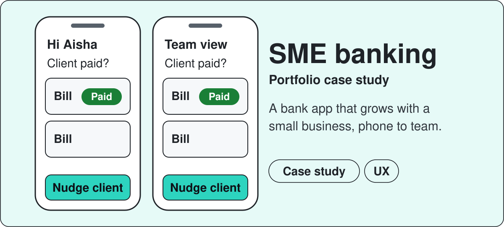

<picture><source media="(prefers-color-scheme: dark)" srcset="assets/v2/hero-dark.svg"></picture>

<picture><source media="(prefers-color-scheme: dark)" srcset="assets/v2/building-dark.svg"></picture>

<a href="https://github.com/TANISHQBAFNA/resolve"><picture><source media="(prefers-color-scheme: dark)" srcset="assets/v2/band-resolve-dark.svg"></picture></a>

<a href="https://www.tanishqbafna.com"><picture><source media="(prefers-color-scheme: dark)" srcset="assets/v2/band-sme-dark.svg"></picture></a>

<a href="https://github.com/TANISHQBAFNA/rewind-tv"><picture><source media="(prefers-color-scheme: dark)" srcset="assets/v2/band-tv-dark.svg"></picture></a>

<picture><source media="(prefers-color-scheme: dark)" srcset="assets/v2/how-dark.svg"></picture>

<picture><source media="(prefers-color-scheme: dark)" srcset="assets/v2/skills-dark.svg"></picture>

<picture><source media="(prefers-color-scheme: dark)" srcset="assets/v2/contact-dark.svg"></picture>

<a href="https://www.tanishqbafna.com">Website</a> · <a href="https://www.linkedin.com/in/tanishqbafna/">LinkedIn</a> · <a href="https://www.behance.net/tanishqbafna">Behance</a>

